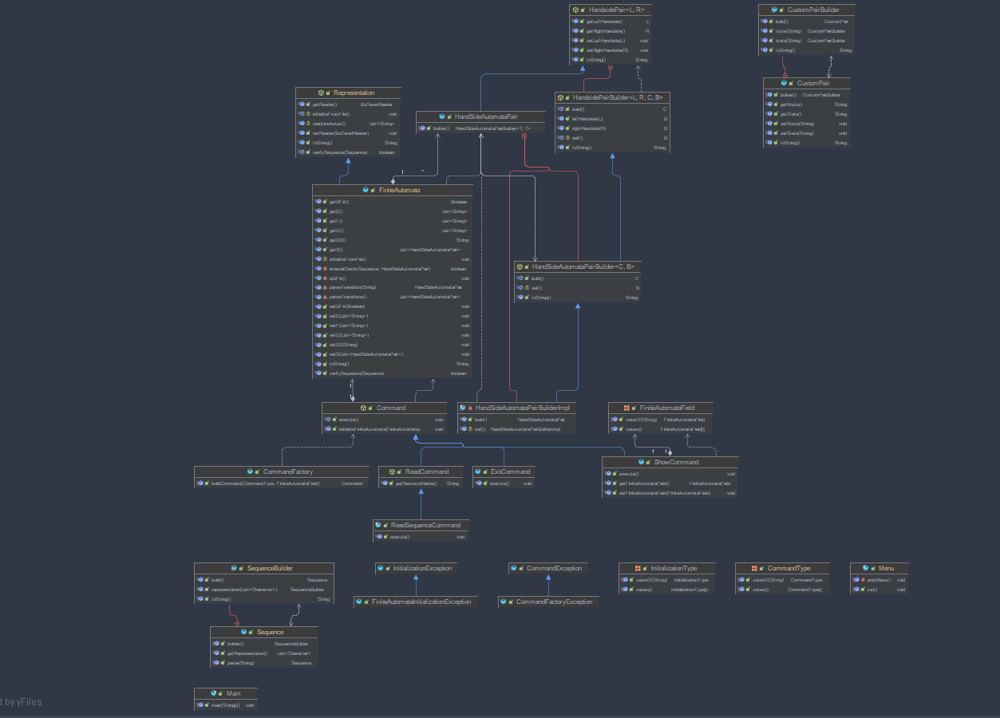
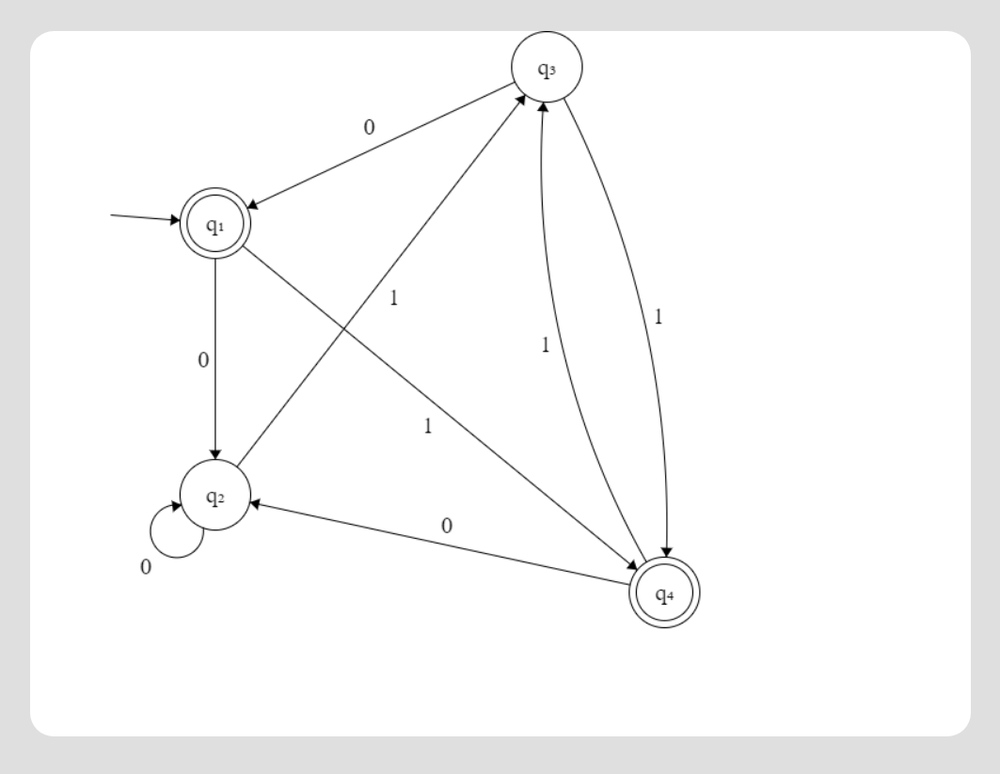

github link to the repository :
https://github.com/Betterslash/ubb-third-year/tree/master/sem-one/formal-languages-and-compiler-design/laboratory-3/src/main

<h1>Finite Automata</h1>
<h2>Requirements</h2>
Write a program that:

1. Reads the elements of a FA (from file)
2. Displays the elements of a finite automata, using a menu: the set of states, the alphabet, all the transitions, the set of final states.
3. For a DFA, verify if a sequence is accepted by the FA.

<h2>Finite Automata File Format</h2>
General:

1. digit ::= 0 | 1 | 2 |...| 9
2. elemDigit ::= 1 | 2 | ... | 9
3. number ::= elemDigit{digit} | 0
4. chr ::= 'A' | 'B' | 'C' | ... | 'Z' | 'a' | 'b' | ... | 'z'
5. word ::= chr{chr}

Grammar Specific:
1. file ::= Q\n E\n q0\n S\n 
2. Q ::= 'Q = {' Qelems '}'
    1. Qelems ::= ' 'word number','Qelems | ' q'word number
3. E :: = 'E = {' Eelems '}'
   1. Eelems ::= ' 'number','Eelems | ' number'
4. q0 ::= 'q0 = 'word number
5. F ::= 'F = {' Qelems '}'
6. S ::= 'S = {\n' state ' }'
   1. state ::= '(' Qelems', ' number ') -> ' Qelems',\n\t'state |  '(' Qelems', ' number ') -> ' Qelems'

<h2>Diagram </h2>

<h2>How it works</h2>
1. Parses a given file respcting the rules defined above
2. Mapps it to a FiniteAutomata object which has properties : Q, E, q0, F, S
3. Uses a command menu for showing different parts of the automata already initialized
4. Storing representation is of type : Pair object (state), String(route) with a String value(resulting state)
5. Can check if the parsed automata is a Deterministic by checking if it doesn't contain states with the same combination of Pair, String values
6. Can check if an input sequence is a valid one for the FiniteAutomata object by recursively checking its possible paths and if those paths cover every part until a final state

<h2>Test Cases</h2>
1. File Representation : 
   1. Q = { q1, q2, q3, q4 } 
   2. E = { 0, 1 } 
   3. q0 = q1 
   4. F = { q1, q4 } 
   5. S = {
   6. \t(q1, 0) -> q2,
   7. \t(q1, 1) -> q4,
   8. \t(q2, 0) -> q2,
   9. \t(q2, 1) -> q3,
   10. \t(q3, 0) -> q1,
   11. \t(q3, 1) -> q4,
   12. \t(q4, 0) -> q2,
   13. \t(q4, 1) -> q3 
   14. }

2. Visual Representation :
   0. 

3. Results :
   1. in: 1 out: [q1, q2, q3, q4]
   2. in: 2 out: [0, 1]
   3. in: 3 out: [HandsidePair(CustomPair(state=q1, route=0), q2), HandsidePair(CustomPair(state=q1, route=1), q4), HandsidePair(CustomPair(state=q2, route=0), q2), HandsidePair(CustomPair(state=q2, route=1), q3), HandsidePair(CustomPair(state=q3, route=0), q1), HandsidePair(CustomPair(state=q3, route=1), q4), HandsidePair(CustomPair(state=q4, route=0), q2), HandsidePair(CustomPair(state=q4, route=1), q3)]
   4. in: 4 out: [q1, q4]
   5. in: 5 out: true
   6. in: 6 
      1. in: 1101 out: true
      2. in: 1111 out: false