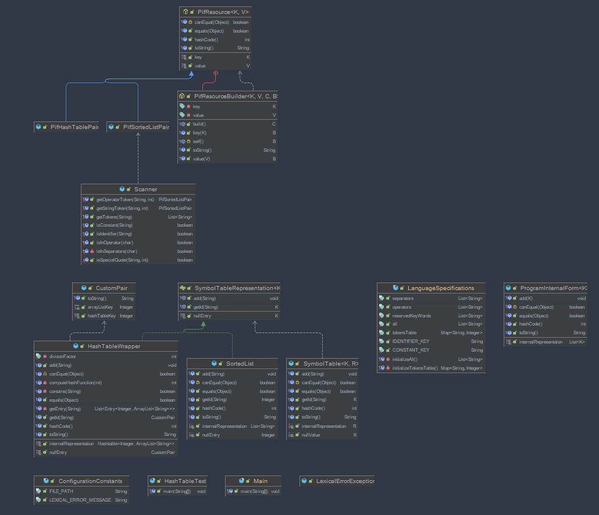

link : https://github.com/Betterslash/ubb-third-year/tree/master/sem-one/formal-languages-and-compiler-design/laboratory_2/scanner/src/main/java

<h1>
    Symbol table representation as HashTable
</h1>

<section>
    <h2>
    symbol_table.HashTableWrapper class : 
    

        <label>  
        Fields :
            <ul>
                <li>
                    - internalRepresentation : HashTable(Integer -> key, String -> value)
                </li>
                <li>
                    - divisonFactor : int (used for hash function computation)
                </li>
            </ul>
        </label>
        <label>  
        Methods :
            <ul>
                <li>
                    + default constructor -> initializes an empty internalRepresentation
                </li>
                <li>
                    + add(token : string) -> verifies if token is already is in internalRepresentation 
                                             if it is not -> adds the token
                                             else ->    
                </li>
                <li>
                    - computeHashFunction(valueOfTokenAsAscii : int) -> returns the computed hash function
                </li>
                <li>
                    - contains(token : string) -> returns true if internalRepresentaion contains token false otherwise
                </li>
                <li>
                    -  getEntry(token : string) -> returns the representation for a token in hashtable 
                </li>
                <li>
                    + getId(token : string) -> returns a Pif.CustomPair(hashPosition : int, arrayPosition : int) for an entry
                </li>
            </ul>
        </label>
    

</h2>
</section>
<section>
<h1>Scanner</h1>
<h2>Scanner diagram</h2>

<h2>
    How does it work : 
        
</h2>
<h4>-> Goes line by line, character by character and does the suitable checks to determine if a character should be one of three main types : </h4>

Constant

Identifier

Language specification included word -> operator, separator

<h4>-> </h4>
<h3>Functions : </h3>
<ul>
    <li>
        
isInOperator -> checks if a character is part of an orpeator

    </li>
    <li>
        
getStringOperator -> determines if the token will be a string and goes to determine the resulted string constant

    </li>
    <li>
        
getOperatorToken -> checks if a character is part of an operator also if the character is '-' then checks if the '-' isn't actually a number sign and if it is it will return the negative resulted number else it will return the operator 

    </li>
    <li>
        
isInSeparators -> checks if a character is part of an separators

    </li>
    <li>
        
isIdentifier -> checks if a character is an identifier type entry

    </li>
    <li>
        
isConstant -> checks if an character is a constant type entry

    </li>
    <li>
        
getTokens -> main function which build paris of key values as a list and returns them, those key value pairs representing the PIF entries

    </li>
</ul>
</section>
<section>
    <h1>Human readable description
    </h1>
    <H2>How does it work except of generic scanning</H2>
    

        -> LanguageSpecifications Object -> determines which characters are forming a valid entry in my toy language 
        * after initializing itself
        -> ConfigurationConstants has only some paths and string formatation rules for the program to be easly modifiable
        -> Because the Symbol table takes as internal representation any SynbaleTableRepresentation children it can work with both SortedList implemented in symbol_table as well as with the HashTableWrapper 
        -> PifResource works as the SymbolTableRepresentation such that it makes the implementations adaptable to multiple types of symbol table internal representations
    

</section>