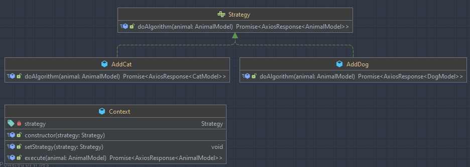
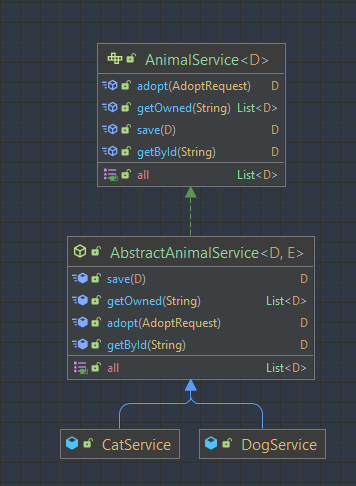

#Pets Manager Application
##Technologies : 
###SpringBoot   -> Backend
###ReactTs      -> Frontend

##Desing Patterns Used :
### Creational : 
####1 Builder (annotation + implementation)
### Structural
####1 Adapter (used as mapper to dtos and also between the different kinds of repository)
####2 Bridge (used in the web part for adapting a model to different type of views with minimum code required)
### Behavioural
####1 Strategy  (used in web for deciding the right functions on different views depending on context)
####2 Template Method 